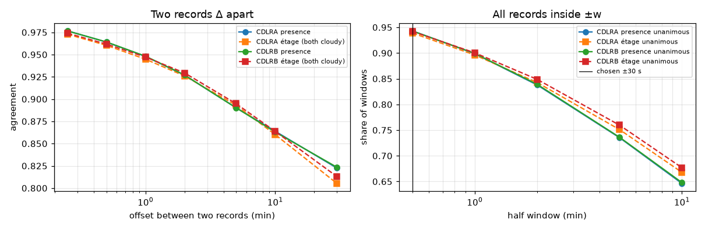

# Ceilometer QC and pairing tolerance (P031)

Lufft CHM15k records of the two Eye2Sky ceilometers (CDLRA, CDLRB; April to July 2022; one record every 15 s), checked for completeness, physical range, layer order and quality flags, then used to decide how far in time a camera frame may be from the records that label it.

## QC summary

| Quantity | CDLRA | CDLRB |
|---|---|---|
| records | 679,663 | 679,666 |
| days | 118 | 118 |
| records per day min | 5,759 | 5,759 |
| records per day median | 5,760 | 5,760 |
| records per day max | 5,760 | 5,760 |
| completeness | 100.0% | 100.0% |
| duplicate times | 0 | 0 |
| gaps over 60s | 2 | 2 |
| longest gap s | 172,819 s | 172,804 s |
| cbh1 over max | 0 | 0 |
| layer order violations | 0 | 0 |
| cloud present | 67.4% | 68.1% |
| layers 2plus | 14.8% | 14.8% |
| rain | 2.86% | 3.11% |
| fog | 0.05% | 0.03% |
| snow | 0.00% | 0.00% |
| window | 3.02% | 0.37% |
| optics low | 2.85% | 0.43% |
| laser warning | 57.9% | 0.0% |
| error | 0.57% | 0.01% |
| qc any | 6.1% | 3.5% |
| cbh1 median clean m | 1,910 m | 1,848 m |

## CDLRA: two records Δ apart (QC-clean)

| Δ | Pairs | Presence agreement | Étage agreement (both cloudy) | Median |Δ base| | Within 200 m | Within 10 % |
|---|---|---|---|---|---|---|
| 15 s | 636,555 | 97.7% | 97.3% | 10 m | 93.7% | 90.3% |
| 30 s | 636,174 | 96.4% | 96.0% | 15 m | 90.4% | 85.9% |
| 60 s | 635,752 | 94.8% | 94.5% | 27 m | 86.1% | 81.0% |
| 120 s | 634,917 | 92.7% | 92.6% | 44 m | 80.4% | 75.9% |
| 300 s | 632,889 | 89.0% | 89.3% | 85 m | 69.3% | 67.2% |
| 600 s | 630,049 | 86.4% | 86.0% | 130 m | 59.8% | 59.5% |
| 1800 s | 622,463 | 82.2% | 80.5% | 237 m | 46.5% | 46.2% |

## CDLRB: two records Δ apart (QC-clean)

| Δ | Pairs | Presence agreement | Étage agreement (both cloudy) | Median |Δ base| | Within 200 m | Within 10 % |
|---|---|---|---|---|---|---|
| 15 s | 653,745 | 97.7% | 97.4% | 10 m | 93.4% | 89.5% |
| 30 s | 652,764 | 96.4% | 96.2% | 15 m | 90.0% | 84.8% |
| 60 s | 651,516 | 94.8% | 94.7% | 27 m | 85.7% | 80.1% |
| 120 s | 650,897 | 92.7% | 92.9% | 45 m | 80.1% | 74.9% |
| 300 s | 649,250 | 89.0% | 89.5% | 88 m | 68.6% | 66.0% |
| 600 s | 647,251 | 86.3% | 86.4% | 134 m | 59.4% | 58.4% |
| 1800 s | 642,936 | 82.3% | 81.3% | 235 m | 46.4% | 45.6% |

## CDLRA: all records inside ±w (1-minute grid, QC-clean)

| ±w | Windows with records | Coverage | Records per window | Presence unanimous | Étage unanimous |
|---|---|---|---|---|---|
| 30 s | 159,959 | 91.8% | 4.1 | 94.3% | 93.9% |
| 60 s | 160,304 | 92.0% | 8.0 | 89.9% | 89.6% |
| 120 s | 160,813 | 92.3% | 15.9 | 83.8% | 84.3% |
| 300 s | 161,977 | 93.0% | 39.5 | 73.5% | 75.1% |
| 600 s | 163,382 | 93.8% | 78.2 | 64.6% | 66.8% |

## CDLRB: all records inside ±w (1-minute grid, QC-clean)

| ±w | Windows with records | Coverage | Records per window | Presence unanimous | Étage unanimous |
|---|---|---|---|---|---|
| 30 s | 164,657 | 94.5% | 4.0 | 94.3% | 94.2% |
| 60 s | 165,096 | 94.8% | 8.0 | 89.9% | 90.0% |
| 120 s | 165,740 | 95.1% | 15.9 | 83.9% | 84.9% |
| 300 s | 166,820 | 95.7% | 39.4 | 73.6% | 76.0% |
| 600 s | 167,811 | 96.3% | 78.2 | 64.8% | 67.7% |

## The two sites at the same instants

- Pairs within 10 s: 627,840; presence agreement 82.0%; étage agreement (both cloudy) 79.6%; median |difference| of the base 255 m; within 500 m 65.6%.

## Pairing tolerance

Chosen half-window: **±30 s** (4.0 records per window; presence unanimous 94.3%, étage unanimous 94.0%).

- Chosen: **±30 s**. Two records 30 s apart agree on cloud presence / on the étage of the lowest base in 96.4% / 96.1% of cases (the instrument's own 15 s consistency is 97.7% / 97.3%); at 2 min the disagreement roughly doubles (92.7% / 92.8%) and at 5 min triples (89.0% / 89.4%). Inside ±30 s a window holds 4.0 clean records on average, all of which agree in 94.3% (presence) and 94.0% (étage) of windows. The label of a frame is the median lowest base of the clean records in its window, the share of cloudy records is kept as the label's confidence, and a window without a clean record gives no label (P036).
- Rejected: ±2 min and ±5 min, which would label 1 and 1.5 points more of the minutes (coverage 92-93 % against 93-96 %) at twice and three times the time-mismatch noise; and ±15 s, where one dropout decides the label.
- The two sites 15 km apart agree on presence and étage far less often than two records a few minutes apart at one site: a cloud base is local, which is why CDLRB is a genuine held-out site (criterion C3) and why a model cannot be scored against a distant ceilometer.
