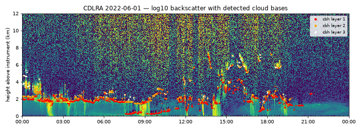
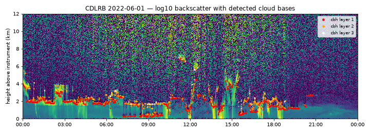

# Ceilometer summary (CHM15k, Eye2Sky)

Generated by `scripts/ceilometer_summary.py` (P014). Heights are metres above the instrument; statistics over all records, CBH climatology over records without any QC flag.

| Ceilometer | Days | Records | Cloud (lowest layer present) | Median lowest CBH (m) | ≥ 2 layers | Rain | Particles on window | Optics < 50 % | Error bits | Laser warning (0x8000) |
|---|---|---|---|---|---|---|---|---|---|---|
| CDLRA | 118 | 679,663 | 67.4% | 1910 | 14.8% | 2.9% | 3.0% | 2.9% | 0.6% | 57.9% |
| CDLRB | 118 | 679,666 | 68.1% | 1848 | 14.8% | 3.1% | 0.4% | 0.4% | 0.0% | 0.0% |

## Lowest-cloud-base climatology (QC-clean records)

| Ceilometer | 0–1 km | 1–2 km | 2–4 km | 4–8 km | 8–12 km |
|---|---|---|---|---|---|
| CDLRA | 22.1% | 29.8% | 19.8% | 17.8% | 10.4% |
| CDLRB | 24.1% | 29.1% | 18.9% | 17.3% | 10.5% |

