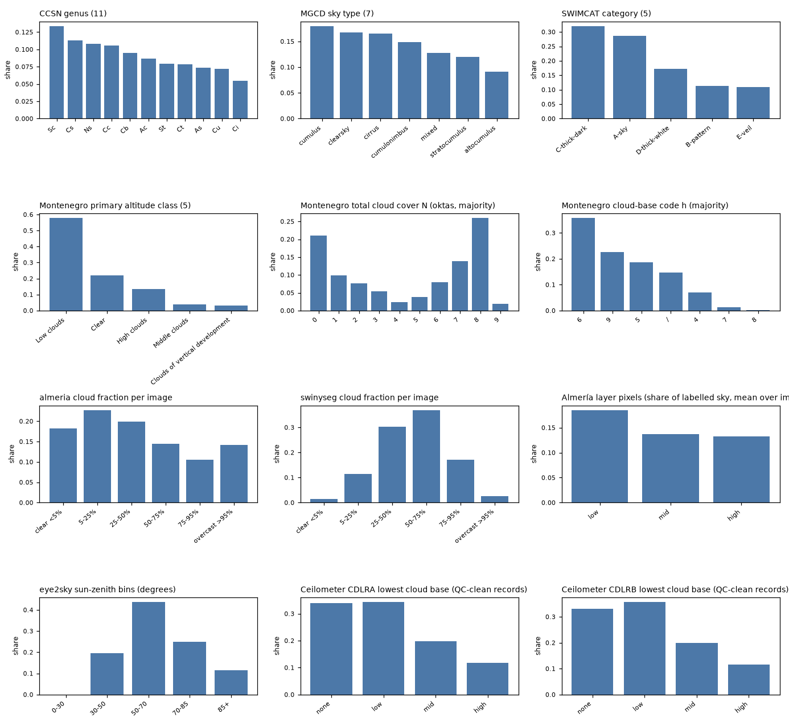

# Imbalance report (P030)

Label distributions per dataset (native classes, official splits where they exist, Montenegro majority codes, segmentation cloud fraction, sun-zenith bins, ceilometer cloud-base bins) with three imbalance numbers each: the largest/smallest class ratio, the normalised entropy (1 = uniform) and the effective number of classes exp(H). The sampling rules chosen for training are at the end.

## CCSN genus (11)

Native labels, all images. 11 classes, largest/smallest 2.4, normalised entropy 0.99, effective classes 10.7.

| Value | Count | Share |
|---|---|---|
| Sc | 340 | 13.4% |
| Cs | 287 | 11.3% |
| Ns | 274 | 10.8% |
| Cc | 268 | 10.5% |
| Cb | 242 | 9.5% |
| Ac | 221 | 8.7% |
| St | 202 | 7.9% |
| Ct | 200 | 7.9% |
| As | 188 | 7.4% |
| Cu | 182 | 7.2% |
| Ci | 139 | 5.5% |

## MGCD sky type (7)

Native labels, all images. 7 classes, largest/smallest 2.0, normalised entropy 0.99, effective classes 6.9.

| Value | Count | Share |
|---|---|---|
| cumulus | 1,438 | 18.0% |
| clearsky | 1,338 | 16.7% |
| cirrus | 1,323 | 16.5% |
| cumulonimbus | 1,187 | 14.8% |
| mixed | 1,020 | 12.8% |
| stratocumulus | 963 | 12.0% |
| altocumulus | 731 | 9.1% |

## MGCD sky type (7), official test

Native labels in the published split. 7 classes, largest/smallest 2.3, normalised entropy 0.98, effective classes 6.8.

| Value | Count | Share |
|---|---|---|
| cumulus | 748 | 18.7% |
| clearsky | 688 | 17.2% |
| cirrus | 673 | 16.8% |
| cumulonimbus | 587 | 14.7% |
| mixed | 510 | 12.8% |
| stratocumulus | 463 | 11.6% |
| altocumulus | 331 | 8.3% |

## MGCD sky type (7), official train

Native labels in the published split. 7 classes, largest/smallest 1.7, normalised entropy 0.99, effective classes 6.9.

| Value | Count | Share |
|---|---|---|
| cumulus | 690 | 17.2% |
| cirrus | 650 | 16.2% |
| clearsky | 650 | 16.2% |
| cumulonimbus | 600 | 15.0% |
| mixed | 510 | 12.8% |
| stratocumulus | 500 | 12.5% |
| altocumulus | 400 | 10.0% |

## SWIMCAT category (5)

Native labels, all images. 5 classes, largest/smallest 3.0, normalised entropy 0.94, effective classes 4.5.

| Value | Count | Share |
|---|---|---|
| C-thick-dark | 251 | 32.0% |
| A-sky | 224 | 28.6% |
| D-thick-white | 135 | 17.2% |
| B-pattern | 89 | 11.4% |
| E-veil | 85 | 10.8% |

## Montenegro primary altitude class (5)

First class of the rater majority. 5 classes, largest/smallest 18.7, normalised entropy 0.72, effective classes 3.2.

| Value | Count | Share |
|---|---|---|
| Low clouds | 1,457 | 57.8% |
| Clear | 551 | 21.8% |
| High clouds | 338 | 13.4% |
| Middle clouds | 98 | 3.9% |
| Clouds of vertical development | 78 | 3.1% |

## Montenegro altitude classes present (multi-label)

Every class named in the majority set, counted once per image. 5 classes, largest/smallest 20.5, normalised entropy 0.73, effective classes 3.2.

| Value | Count | Share |
|---|---|---|
| Low clouds | 1,600 | 57.9% |
| Clear | 551 | 19.9% |
| High clouds | 370 | 13.4% |
| Middle clouds | 166 | 6.0% |
| Clouds of vertical development | 78 | 2.8% |

## Montenegro total cloud cover N (oktas, majority)

Majority rater code; 9 = sky obscured. 10 classes, largest/smallest 13.9, normalised entropy 0.88, effective classes 7.6.

| Value | Count | Share |
|---|---|---|
| 0 | 532 | 21.1% |
| 1 | 251 | 10.0% |
| 2 | 194 | 7.7% |
| 3 | 135 | 5.4% |
| 4 | 61 | 2.4% |
| 5 | 98 | 3.9% |
| 6 | 200 | 7.9% |
| 7 | 350 | 13.9% |
| 8 | 654 | 25.9% |
| 9 | 47 | 1.9% |

## Montenegro cloud-base code h (majority)

WMO code table 1600 (0 = lowest band ... 9 = above 2,500 m or no cloud; / = unknown). 7 classes, largest/smallest 300.3, normalised entropy 0.80, effective classes 4.7.

| Value | Count | Share |
|---|---|---|
| 6 | 901 | 35.7% |
| 9 | 569 | 22.6% |
| 5 | 469 | 18.6% |
| / | 371 | 14.7% |
| 4 | 176 | 7.0% |
| 7 | 33 | 1.3% |
| 8 | 3 | 0.1% |

## almeria mask pixels (sky / cloud, mean over images)

Share of labelled sky pixels. 2 classes, largest/smallest 1.3, normalised entropy 0.98, effective classes 2.0.

| Value | Count | Share |
|---|---|---|
| sky | 573 | 57.3% |
| cloud | 427 | 42.7% |

## almeria cloud fraction per image

Share of each image's labelled sky that is cloud. 6 classes, largest/smallest 2.2, normalised entropy 0.98, effective classes 5.8.

| Value | Count | Share |
|---|---|---|
| clear <5% | 149 | 18.2% |
| 5-25% | 186 | 22.7% |
| 25-50% | 163 | 19.9% |
| 50-75% | 118 | 14.4% |
| 75-95% | 86 | 10.5% |
| overcast >95% | 116 | 14.2% |

## shwimseg mask pixels (sky / cloud, mean over images)

Share of labelled sky pixels. 2 classes, largest/smallest 1.3, normalised entropy 0.99, effective classes 2.0.

| Value | Count | Share |
|---|---|---|
| sky | 431 | 43.1% |
| cloud | 569 | 56.9% |

## shwimseg cloud fraction per image

Share of each image's labelled sky that is cloud. 4 classes, largest/smallest 10.0, normalised entropy 0.87, effective classes 3.3.

| Value | Count | Share |
|---|---|---|
| clear <5% | 0 | 0.0% |
| 5-25% | 6 | 3.8% |
| 25-50% | 60 | 38.5% |
| 50-75% | 51 | 32.7% |
| 75-95% | 39 | 25.0% |
| overcast >95% | 0 | 0.0% |

## swimseg mask pixels (sky / cloud, mean over images)

Share of labelled sky pixels. 2 classes, largest/smallest 1.2, normalised entropy 0.99, effective classes 2.0.

| Value | Count | Share |
|---|---|---|
| sky | 455 | 45.5% |
| cloud | 545 | 54.5% |

## swimseg cloud fraction per image

Share of each image's labelled sky that is cloud. 6 classes, largest/smallest 31.8, normalised entropy 0.80, effective classes 4.2.

| Value | Count | Share |
|---|---|---|
| clear <5% | 12 | 1.2% |
| 5-25% | 114 | 11.3% |
| 25-50% | 292 | 28.8% |
| 50-75% | 381 | 37.6% |
| 75-95% | 188 | 18.6% |
| overcast >95% | 26 | 2.6% |

## swinseg mask pixels (sky / cloud, mean over images)

Share of labelled sky pixels. 2 classes, largest/smallest 1.1, normalised entropy 1.00, effective classes 2.0.

| Value | Count | Share |
|---|---|---|
| sky | 533 | 53.3% |
| cloud | 467 | 46.7% |

## swinseg cloud fraction per image

Share of each image's labelled sky that is cloud. 5 classes, largest/smallest 54.0, normalised entropy 0.65, effective classes 2.8.

| Value | Count | Share |
|---|---|---|
| clear <5% | 1 | 0.9% |
| 5-25% | 10 | 8.7% |
| 25-50% | 54 | 47.0% |
| 50-75% | 48 | 41.7% |
| 75-95% | 2 | 1.7% |
| overcast >95% | 0 | 0.0% |

## swinyseg mask pixels (sky / cloud, mean over images)

Share of labelled sky pixels. 2 classes, largest/smallest 1.2, normalised entropy 1.00, effective classes 2.0.

| Value | Count | Share |
|---|---|---|
| sky | 464 | 46.4% |
| cloud | 536 | 53.6% |

## swinyseg cloud fraction per image

Share of each image's labelled sky that is cloud. 6 classes, largest/smallest 25.8, normalised entropy 0.80, effective classes 4.2.

| Value | Count | Share |
|---|---|---|
| clear <5% | 97 | 1.4% |
| 5-25% | 776 | 11.5% |
| 25-50% | 2,054 | 30.3% |
| 50-75% | 2,498 | 36.9% |
| 75-95% | 1,163 | 17.2% |
| overcast >95% | 180 | 2.7% |

## Almería layer pixels (share of labelled sky, mean over images)

Low / mid / high cloud layer classes. 3 classes, largest/smallest 1.4, normalised entropy 0.99, effective classes 3.0.

| Value | Count | Share |
|---|---|---|
| low | 185 | 18.5% |
| mid | 137 | 13.7% |
| high | 132 | 13.2% |

## eye2sky sun-zenith bins (degrees)

From time and site (P021). 4 classes, largest/smallest 3.8, normalised entropy 0.92, effective classes 3.6.

| Value | Count | Share |
|---|---|---|
| 0-30 | 0 | 0.0% |
| 30-50 | 5,767 | 19.7% |
| 50-70 | 12,794 | 43.7% |
| 70-85 | 7,321 | 25.0% |
| 85+ | 3,406 | 11.6% |

## b0268 sun-zenith bins (degrees)

From time and site (P021). 1 classes, largest/smallest 1.0, normalised entropy 1.00, effective classes 1.0.

| Value | Count | Share |
|---|---|---|
| 0-30 | 0 | 0.0% |
| 30-50 | 0 | 0.0% |
| 50-70 | 25 | 100.0% |
| 70-85 | 0 | 0.0% |
| 85+ | 0 | 0.0% |

## Montenegro hour (UTC)

Hour of the frame. 14 classes, largest/smallest 1.1, normalised entropy 1.00, effective classes 14.0.

| Value | Count | Share |
|---|---|---|
| 15 | 191 | 7.6% |
| 16 | 190 | 7.5% |
| 19 | 184 | 7.3% |
| 12 | 181 | 7.2% |
| 14 | 181 | 7.2% |
| 13 | 180 | 7.1% |
| 11 | 179 | 7.1% |
| 17 | 179 | 7.1% |
| 18 | 178 | 7.1% |
| 10 | 178 | 7.1% |
| 7 | 177 | 7.0% |
| 6 | 176 | 7.0% |
| 9 | 175 | 6.9% |
| 8 | 173 | 6.9% |

## Ceilometer CDLRA lowest cloud base (QC-clean records)

none = no cloud overhead; low < 2 km, mid 2-6 km, high > 6 km. 4 classes, largest/smallest 2.9, normalised entropy 0.94, effective classes 3.7.

| Value | Count | Share |
|---|---|---|
| none | 216,945 | 34.0% |
| low | 218,784 | 34.3% |
| mid | 126,529 | 19.8% |
| high | 75,783 | 11.9% |

## Ceilometer CDLRA layer count

Number of cloud layers reported (QC-clean records). 5 classes, largest/smallest 111.7, normalised entropy 0.67, effective classes 3.0.

| Value | Count | Share |
|---|---|---|
| 0 | 216,945 | 34.0% |
| 1 | 324,804 | 50.9% |
| 2 | 77,819 | 12.2% |
| 3 | 15,565 | 2.4% |
| 4 | 2,908 | 0.5% |

## Ceilometer CDLRB lowest cloud base (QC-clean records)

none = no cloud overhead; low < 2 km, mid 2-6 km, high > 6 km. 4 classes, largest/smallest 3.1, normalised entropy 0.94, effective classes 3.7.

| Value | Count | Share |
|---|---|---|
| none | 216,462 | 33.0% |
| low | 233,827 | 35.7% |
| mid | 129,952 | 19.8% |
| high | 75,487 | 11.5% |

## Ceilometer CDLRB layer count

Number of cloud layers reported (QC-clean records). 5 classes, largest/smallest 124.9, normalised entropy 0.67, effective classes 2.9.

| Value | Count | Share |
|---|---|---|
| 0 | 216,462 | 33.0% |
| 1 | 340,580 | 51.9% |
| 2 | 80,225 | 12.2% |
| 3 | 15,734 | 2.4% |
| 4 | 2,727 | 0.4% |

## Sources and the sampling rule

Share of each source under natural (proportional), square-root (chosen) and uniform sampling.

| Source | Images | Natural | Square root | Uniform | Oversampling (sqrt / natural) |
|---|---|---|---|---|---|
| eye2sky | 29,288 | 56.3% | 35.0% | 14.3% | 0.62x |
| swim-family | 8,836 | 17.0% | 19.2% | 14.3% | 1.13x |
| mgcd | 8,000 | 15.4% | 18.3% | 14.3% | 1.19x |
| ccsn | 2,543 | 4.9% | 10.3% | 14.3% | 2.11x |
| montenegro | 2,522 | 4.8% | 10.3% | 14.3% | 2.12x |
| almeria | 818 | 1.6% | 5.9% | 14.3% | 3.72x |
| b0268 | 25 | 0.0% | 1.0% | 14.3% | 21.29x |

### Class-balanced loss weights, CCSN (beta = 0.999, mean 1)

| Class | Images | Weight |
|---|---|---|
| Sc | 340 | 0.68 |
| Cs | 287 | 0.79 |
| Ns | 274 | 0.82 |
| Cc | 268 | 0.83 |
| Cb | 242 | 0.91 |
| Ac | 221 | 0.99 |
| St | 202 | 1.07 |
| Ct | 200 | 1.08 |
| As | 188 | 1.14 |
| Cu | 182 | 1.18 |
| Ci | 139 | 1.51 |

### Class-balanced loss weights, MGCD (beta = 0.999, mean 1)

| Class | Images | Weight |
|---|---|---|
| cumulus | 1,438 | 0.87 |
| clearsky | 1,338 | 0.90 |
| cirrus | 1,323 | 0.90 |
| cumulonimbus | 1,187 | 0.95 |
| mixed | 1,020 | 1.03 |
| stratocumulus | 963 | 1.07 |
| altocumulus | 731 | 1.28 |

### Class-balanced loss weights, ceilometer bins (both sites) (beta = 0.999, mean 1)

| Class | Images | Weight |
|---|---|---|
| none | 433,407 | 1.00 |
| low | 452,611 | 1.00 |
| mid | 256,481 | 1.00 |
| high | 151,270 | 1.00 |

## Decision

- **Sources are sampled in proportion to the square root of their size** (table above). Natural sampling would make Eye2Sky 56 % of every epoch and the five smallest sources under 2 % together; uniform sampling would show the 25 B0268 frames and the 115 SWINSEG images thousands of times per epoch. The square root keeps the largest source near a third and lifts the small ones to a few percent. Rejected: natural (majority-camera collapse, the P029 shortcut) and uniform (over-fitting of tiny sources).
- **Within a source, classes are weighted in the loss by the class-balanced rule** (1 - beta) / (1 - beta^n) with beta = 0.999, which approaches uniform weighting for rare classes and natural weighting for common ones; CCSN's 11 genera (ratio 2.4) and MGCD's 7 types (ratio 2.0) need it mildly, the ceilometer bins (none / low / mid / high) more. Rejected: class-uniform resampling, which duplicates rare images and leaks through near-duplicates.
- **Soft labels are never resampled**: Montenegro's rater distributions and merged conflict sets are used as targets as they are; balancing acts through the loss weight only.
- **Metrics are macro by default** (macro-F1 over genera and étages, balanced accuracy for oktas and CBH bins), reported next to the micro numbers, so a majority-class collapse is visible.
- **Evaluation is also reported by sun-zenith bin** (Eye2Sky, B0268) and, for the segmentation sets, by cloud-fraction bin, because P029 showed the hour of day is readable from the features and the overcast/clear extremes dominate several sets.
