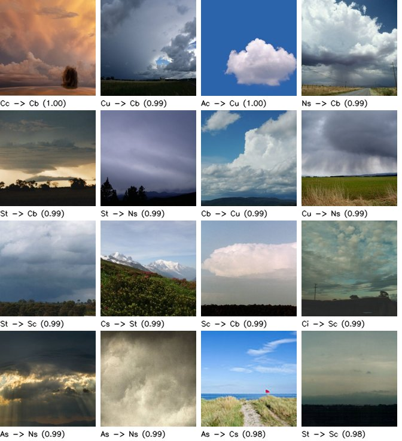
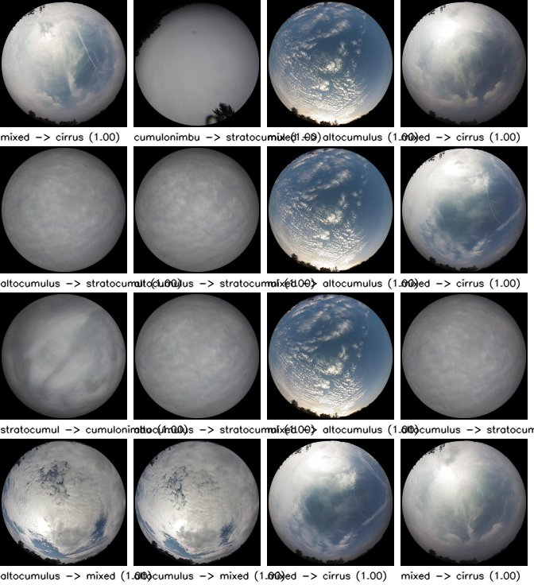
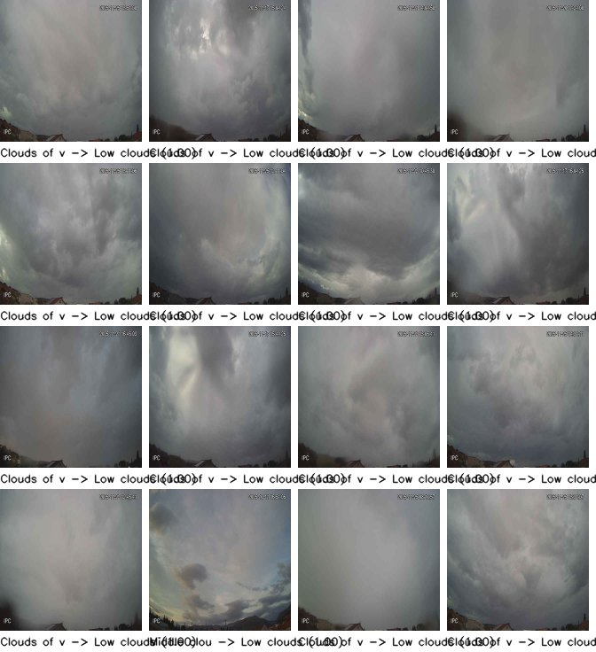

# Label-noise estimation report (P040)

Confident-learning style flags from out-of-fold logistic-regression probes on frozen DINOv3 ViT-S/16 features (folds by split unit). A flag means the probe is more confident in another class than the class's own typical confidence; it is a suggestion for review. Nothing is deleted or relabelled. Flags: `data/label_noise_flags.parquet`.

Strong flags: the suggested class has probability >= 0.5 and leads the given class by >= 0.25.

| Dataset | Images | Flagged | Share | Strong flags | Strong share | Median margin |
|---|---|---|---|---|---|---|
| ccsn | 2,543 | 1,173 | 46.1% | 742 | 29.2% | 0.49 |
| mgcd | 8,000 | 554 | 6.9% | 554 | 6.9% | 0.87 |
| swimcat | 784 | 0 | 0.0% | 0 | 0.0% | nan |
| montenegro | 2,522 | 1,396 | 55.4% | 270 | 10.7% | -0.86 |

## ccsn: most frequent given → suggested

| Given | Suggested | Flags |
|---|---|---|
| Sc | St | 58 |
| Cc | Ac | 53 |
| Ns | St | 42 |
| St | Sc | 40 |
| Ac | Cc | 38 |
| Ns | As | 33 |
| As | Ac | 30 |
| Cs | Ci | 30 |
| As | Ns | 29 |
| Cb | Cu | 28 |

## mgcd: most frequent given → suggested

| Given | Suggested | Flags |
|---|---|---|
| altocumulus | mixed | 96 |
| stratocumulus | cumulonimbus | 79 |
| mixed | cirrus | 69 |
| cirrus | mixed | 66 |
| cumulonimbus | stratocumulus | 62 |
| mixed | altocumulus | 34 |
| altocumulus | stratocumulus | 29 |
| cirrus | clearsky | 19 |
| mixed | cumulonimbus | 16 |
| clearsky | cirrus | 15 |

## swimcat: most frequent given → suggested

| Given | Suggested | Flags |
|---|---|---|

## montenegro: most frequent given → suggested

| Given | Suggested | Flags |
|---|---|---|
| Low clouds | Clouds of vertical development | 597 |
| Clear | Clouds of vertical development | 227 |
| High clouds | Clouds of vertical development | 195 |
| Low clouds | Middle clouds | 78 |
| Clouds of vertical development | Low clouds | 71 |
| Middle clouds | Clouds of vertical development | 45 |
| High clouds | Clear | 34 |
| Low clouds | High clouds | 27 |
| Middle clouds | Low clouds | 23 |
| Clear | High clouds | 20 |

## Review and decisions

- **No label is changed or removed.** Flags are stored with their suggested class and margin; the data card lists the per-dataset flag shares as a label-noise estimate next to the conflict rates of P026 and the rater agreement of P035.
- **Flagged images stay in training with their given label**; the training recipe may down-weight them (a `noise_flag` weight, P065) and the evaluation reports metrics with and without the flagged test images, so that a reviewer can see how much of an error rate is label noise.
- **Review of the contact sheets** (the most confident flags per dataset) is recorded in the phase document; where the sheet shows a systematic confusion (two classes the dataset itself separates poorly), it is noted as a candidate for merging at evaluation time, not as a correction of the data.
- **The flag rate is a lower bound at the linear-probe level**: the probe cannot see what a fine-tuned model would, and a confident wrong suggestion is as possible as a confident right one; that is why nothing is automated.
