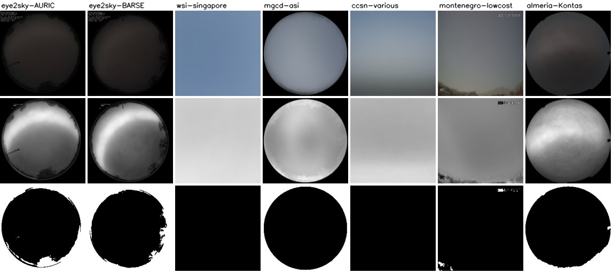

# Shortcut audit report (P029)

Linear probes (logistic regression) on frozen DINOv3 ViT-S/16 CLS features, trained and tested on disjoint days or near-duplicate groups, predicting what a cloud model should not need (dataset, camera, hour of day) and, for scale, the labels themselves. Variants re-embed the same images after a controlled change: `lowres` removes resolution and sharpness, `skyonly` paints the camera's fixed structure grey, `fixedonly` paints everything else grey.

## Fixed structure per camera

Share of the 224 x 224 frame whose standard deviation over the camera's frames is below half the median (fisheye corners, horizon objects, text, logos, borders).

| Camera | Frames | Fixed share |
|---|---|---|
| eye2sky-AURIC | 14,644 | 36.1% |
| eye2sky-BARSE | 14,644 | 37.4% |
| wsi-singapore | 8,680 | 0.0% |
| mgcd-asi | 8,000 | 25.0% |
| ccsn-various | 2,543 | 0.0% |
| montenegro-lowcost | 2,522 | 0.6% |
| almeria-Kontas | 782 | 25.6% |

## Probes

| Task | Variant | Classes | Train | Test | Accuracy | Balanced accuracy | Chance | Majority |
|---|---|---|---|---|---|---|---|---|
| dataset identity (11 datasets) | original | 11 | 7,628 | 2,783 | 99.7% | 99.7% | 9.1% | 21.5% |
| dataset identity (11 datasets) | lowres | 11 | 7,628 | 2,783 | 99.4% | 99.0% | 9.1% | 21.5% |
| SWIMSEG vs SWINySEG-day (same camera) | original | 2 | 5,002 | 2,089 | 99.9% | 99.7% | 50.0% | 86.1% |
| SWIMSEG vs SWINySEG-day (same camera) | lowres | 2 | 5,002 | 2,089 | 99.8% | 99.3% | 50.0% | 86.1% |
| Eye2Sky station (AURIC vs BARSE) | original | 2 | 19,376 | 9,912 | 99.9% | 99.9% | 50.0% | 50.0% |
| Eye2Sky station (AURIC vs BARSE) | skyonly | 2 | 19,376 | 9,912 | 100.0% | 100.0% | 50.0% | 50.0% |
| Eye2Sky station (AURIC vs BARSE) | fixedonly | 2 | 19,376 | 9,912 | 100.0% | 100.0% | 50.0% | 50.0% |
| Eye2Sky station (AURIC vs BARSE) | lowres | 2 | 19,376 | 9,912 | 99.2% | 99.2% | 50.0% | 50.0% |
| Eye2Sky hour of day (UTC) | original | 15 | 19,376 | 9,912 | 28.9% | 28.6% | 6.7% | 7.3% |
| Eye2Sky hour of day (UTC) | skyonly | 15 | 19,376 | 9,912 | 27.4% | 26.5% | 6.7% | 7.3% |
| Eye2Sky hour of day (UTC) | fixedonly | 15 | 19,376 | 9,912 | 43.3% | 43.5% | 6.7% | 7.3% |
| Montenegro hour of day (UTC) | original | 14 | 1,579 | 943 | 31.3% | 31.2% | 7.1% | 7.4% |
| Montenegro hour of day (UTC) | skyonly | 14 | 1,579 | 943 | 32.9% | 32.7% | 7.1% | 7.4% |
| Montenegro hour of day (UTC) | fixedonly | 14 | 1,579 | 943 | 41.7% | 41.5% | 7.1% | 7.4% |
| Montenegro primary class (5) | original | 5 | 1,579 | 943 | 72.7% | 53.0% | 20.0% | 58.9% |
| Montenegro primary class (5) | skyonly | 5 | 1,579 | 943 | 75.3% | 54.7% | 20.0% | 58.9% |
| Montenegro primary class (5) | fixedonly | 5 | 1,579 | 943 | 61.9% | 34.9% | 20.0% | 58.9% |
| MGCD sky type (7) | original | 7 | 5,009 | 2,991 | 85.7% | 85.1% | 14.3% | 20.0% |
| MGCD sky type (7) | lowres | 7 | 5,009 | 2,991 | 83.9% | 84.0% | 14.3% | 20.0% |
| CCSN genus (11) | original | 11 | 1,782 | 761 | 48.0% | 46.1% | 9.1% | 13.8% |
| CCSN genus (11) | lowres | 11 | 1,782 | 761 | 47.2% | 45.9% | 9.1% | 13.8% |
| SWIMCAT category (5) | original | 5 | 549 | 235 | 100.0% | 100.0% | 20.0% | 32.8% |
| SWIMCAT category (5) | lowres | 5 | 549 | 235 | 100.0% | 100.0% | 20.0% | 32.8% |

## Shortcut list and mitigations

| Shortcut | Evidence | Mitigation (where) |
|---|---|---|
| Dataset and camera identity (optics, site, processing, colour response) | dataset probe 99.7 % balanced (chance 9 %); SWIMSEG vs SWINySEG, one camera, 99.7 %; Eye2Sky station 100 % from the sky alone (`skyonly`) on unseen days, 99.2 % after down-sampling: masking and resolution normalisation do not remove it | leave-one-dataset-out and held-out-station evaluation (P037); camera-balanced sampling (P030, P039); per-source numbers next to every pooled one |
| Resolution and sharpness (125 px patches to 2,112 px all-sky frames, JPEG against PNG) | `lowres` (96 px) lowers the dataset probe by 0.7 points and the station probe by 0.7: a small part of the identity signal | resolution normalisation in training: random down-and-up scaling and JPEG re-encoding (P040); one input size; results per source resolution |
| Fixed structure: fisheye corners, horizon objects, mounting parts | 25-37 % of an all-sky frame (Eye2Sky, MGCD, Almería); station 100 % and hour 43 % from `fixedonly` | per-camera validity mask from the std image (`cache/features/camera_stats_224.npz`) at load time: ignore for segmentation, grey or erased for classification (P040) |
| Burned-in text and logos (Eye2Sky top-left block; Montenegro timestamp and logo) | inside the masks; Montenegro `fixedonly` predicts the hour at 41 % (chance 7 %) and the class at 35 % balanced (chance 20 %) | keep the text regions masked in training and evaluation (part of the per-camera mask, P040) |
| Time of day and sun position | hour probes 27-33 % from the sky, 42-44 % from the fixed structure (chance 7 %); P027 same-hour similarity | the sun as an explicit input (ray map, P044); results by sun-zenith bin (P030); day blocks (P027) |
| Colour cast and exposure per camera | the mean images differ in tint and brightness between cameras; exposure state carries the hour | colour jitter and per-image normalisation (P040); grey-world check per camera in the data card (P032) |
