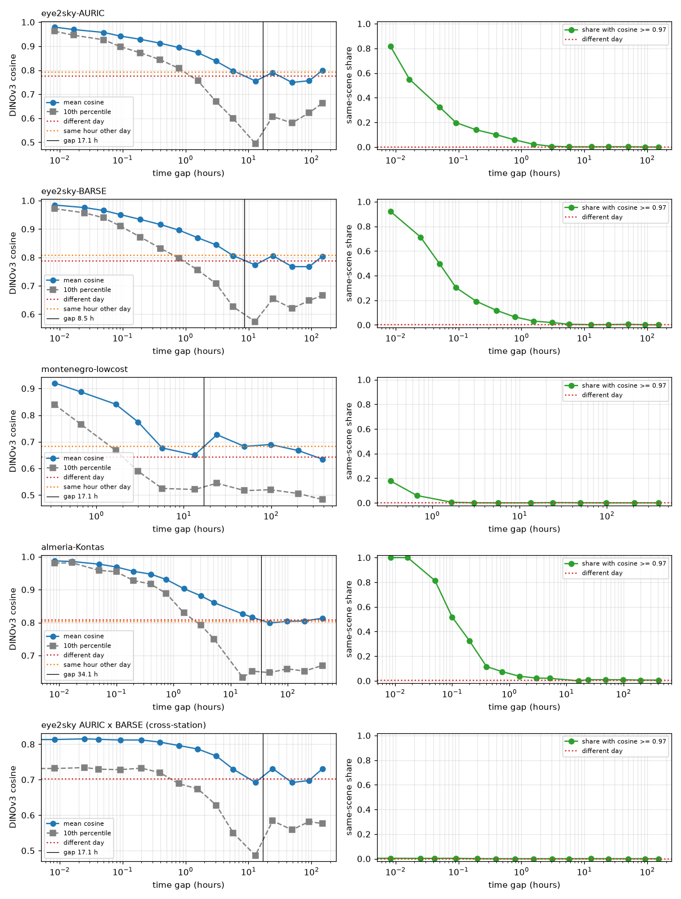

# Temporal autocorrelation report (P027)

Pairs of frames from one camera, sampled at time gaps in doubling bins, measured with the P025 instruments (DINOv3 ViT-S/16 cosine, pHash Hamming distance) and compared with two baselines from the same camera: *different day* (any pair more than a day apart) and *same hour, other day* (less than 30 minutes apart in time of day, on different days: the sun's position alone). The minimum gap for a split is where the curve reaches the different-day baseline (mean-cosine excess <= 10 % of the adjacent-frame excess, and same-scene share within 1 point of the baseline).

## Series

| Camera | Frames | Days | Frames per day (median) | Cadence (median step) | From | To |
|---|---|---|---|---|---|---|
| eye2sky-AURIC | 14,644 | 9 | 1628 | 30 s | 2022-04-01 | 2022-04-09 |
| eye2sky-BARSE | 14,644 | 9 | 1628 | 30 s | 2022-04-01 | 2022-04-09 |
| montenegro-lowcost | 2,522 | 69 | 41 | 20 min | 2025-10-03 | 2025-12-17 |
| almeria-Kontas | 782 | 206 | 2 | 46 min | 2017-01-05 | 2021-12-02 |

## eye2sky-AURIC

| Gap | Pairs | Mean cosine | 10th pct | Same-scene share | Mean pHash distance | Excess |
|---|---|---|---|---|---|---|
| 30 s – 60 s | 5,000 | 0.979 | 0.962 | 81.7% | 6.8 | 1.00 |
| 60 s – 2 min | 5,000 | 0.969 | 0.945 | 55.0% | 9.6 | 0.95 |
| 2 min – 4 min | 5,000 | 0.957 | 0.926 | 32.5% | 11.6 | 0.89 |
| 4 min – 8 min | 5,000 | 0.942 | 0.898 | 19.8% | 13.2 | 0.82 |
| 8 min – 16 min | 5,000 | 0.928 | 0.872 | 13.9% | 14.0 | 0.75 |
| 16 min – 32 min | 5,000 | 0.913 | 0.844 | 10.1% | 15.1 | 0.67 |
| 32 min – 64 min | 5,000 | 0.894 | 0.808 | 5.8% | 16.9 | 0.58 |
| 64 min – 2.1 h | 5,000 | 0.873 | 0.756 | 2.2% | 19.0 | 0.48 |
| 2.1 h – 4.3 h | 5,000 | 0.838 | 0.670 | 0.6% | 20.3 | 0.31 |
| 4.3 h – 8.5 h | 5,000 | 0.798 | 0.599 | 0.1% | 21.4 | 0.11 |
| 8.5 h – 17.1 h | 5,000 | 0.755 | 0.494 | 0.1% | 20.9 | -0.10 |
| 17.1 h – 34.1 h | 5,000 | 0.790 | 0.607 | 0.2% | 21.4 | 0.08 |
| 34.1 h – 2.8 d | 5,000 | 0.749 | 0.580 | 0.2% | 21.7 | -0.12 |
| 2.8 d – 5.7 d | 5,000 | 0.756 | 0.623 | 0.0% | 21.9 | -0.09 |
| 5.7 d – 11.4 d | 5,000 | 0.799 | 0.663 | 0.0% | 23.8 | 0.12 |
| baseline: different day | 20,000 | 0.774 | 0.624 | 0.0% | 22.5 | |
| baseline: same hour other day | 20,000 | 0.791 | 0.654 | 0.1% | 19.4 | |

Minimum gap: by cosine excess 17.1 h; by same-scene share 4.3 h; **decided 17.1 h**.

## eye2sky-BARSE

| Gap | Pairs | Mean cosine | 10th pct | Same-scene share | Mean pHash distance | Excess |
|---|---|---|---|---|---|---|
| 30 s – 60 s | 5,000 | 0.985 | 0.972 | 92.1% | 6.8 | 1.00 |
| 60 s – 2 min | 5,000 | 0.976 | 0.957 | 71.3% | 9.2 | 0.95 |
| 2 min – 4 min | 5,000 | 0.965 | 0.940 | 49.7% | 11.1 | 0.90 |
| 4 min – 8 min | 5,000 | 0.951 | 0.911 | 30.3% | 12.6 | 0.83 |
| 8 min – 16 min | 5,000 | 0.934 | 0.872 | 19.2% | 13.7 | 0.74 |
| 16 min – 32 min | 5,000 | 0.916 | 0.832 | 11.8% | 14.9 | 0.65 |
| 32 min – 64 min | 5,000 | 0.896 | 0.797 | 6.4% | 16.5 | 0.55 |
| 64 min – 2.1 h | 5,000 | 0.869 | 0.756 | 3.1% | 18.9 | 0.41 |
| 2.1 h – 4.3 h | 5,000 | 0.844 | 0.707 | 1.9% | 20.0 | 0.28 |
| 4.3 h – 8.5 h | 5,000 | 0.806 | 0.626 | 0.5% | 20.9 | 0.09 |
| 8.5 h – 17.1 h | 5,000 | 0.774 | 0.574 | 0.2% | 20.6 | -0.08 |
| 17.1 h – 34.1 h | 5,000 | 0.806 | 0.654 | 0.3% | 21.3 | 0.09 |
| 34.1 h – 2.8 d | 5,000 | 0.768 | 0.620 | 0.5% | 21.8 | -0.11 |
| 2.8 d – 5.7 d | 5,000 | 0.767 | 0.648 | 0.1% | 21.9 | -0.11 |
| 5.7 d – 11.4 d | 5,000 | 0.804 | 0.667 | 0.1% | 23.3 | 0.08 |
| baseline: different day | 20,000 | 0.788 | 0.658 | 0.3% | 22.2 | |
| baseline: same hour other day | 20,000 | 0.806 | 0.679 | 0.7% | 19.7 | |

Minimum gap: by cosine excess 8.5 h; by same-scene share 8.5 h; **decided 8.5 h**.

## montenegro-lowcost

| Gap | Pairs | Mean cosine | 10th pct | Same-scene share | Mean pHash distance | Excess |
|---|---|---|---|---|---|---|
| 16 min – 32 min | 5,000 | 0.921 | 0.839 | 17.8% | 13.2 | 1.00 |
| 32 min – 64 min | 5,000 | 0.887 | 0.765 | 6.0% | 15.3 | 0.88 |
| 64 min – 2.1 h | 5,000 | 0.841 | 0.668 | 0.5% | 17.4 | 0.71 |
| 2.1 h – 4.3 h | 5,000 | 0.775 | 0.590 | 0.0% | 20.0 | 0.47 |
| 4.3 h – 8.5 h | 5,000 | 0.677 | 0.525 | 0.0% | 22.9 | 0.12 |
| 8.5 h – 17.1 h | 5,000 | 0.650 | 0.521 | 0.0% | 23.8 | 0.03 |
| 17.1 h – 34.1 h | 5,000 | 0.727 | 0.544 | 0.2% | 21.0 | 0.30 |
| 34.1 h – 2.8 d | 5,000 | 0.683 | 0.517 | 0.1% | 22.4 | 0.14 |
| 2.8 d – 5.7 d | 5,000 | 0.690 | 0.520 | 0.0% | 22.4 | 0.17 |
| 5.7 d – 11.4 d | 5,000 | 0.667 | 0.506 | 0.0% | 23.1 | 0.09 |
| 11.4 d – 22.8 d | 5,000 | 0.635 | 0.483 | 0.0% | 23.8 | -0.03 |
| baseline: different day | 20,000 | 0.643 | 0.482 | 0.0% | 22.9 | |
| baseline: same hour other day | 20,000 | 0.683 | 0.494 | 0.1% | 22.1 | |

Minimum gap: by cosine excess 17.1 h; by same-scene share 2.1 h; **decided 17.1 h**.

## almeria-Kontas

| Gap | Pairs | Mean cosine | 10th pct | Same-scene share | Mean pHash distance | Excess |
|---|---|---|---|---|---|---|
| 30 s – 60 s | 131 | 0.987 | 0.980 | 100.0% | 3.8 | 1.00 |
| 60 s – 2 min | 284 | 0.986 | 0.982 | 100.0% | 7.2 | 0.99 |
| 2 min – 4 min | 991 | 0.977 | 0.959 | 81.3% | 11.6 | 0.95 |
| 4 min – 8 min | 1,704 | 0.969 | 0.954 | 51.8% | 12.1 | 0.90 |
| 8 min – 16 min | 2,804 | 0.956 | 0.928 | 32.6% | 14.6 | 0.82 |
| 16 min – 32 min | 4,507 | 0.947 | 0.917 | 11.6% | 15.6 | 0.78 |
| 32 min – 64 min | 5,000 | 0.931 | 0.888 | 7.4% | 19.9 | 0.69 |
| 64 min – 2.1 h | 5,000 | 0.903 | 0.829 | 3.7% | 25.3 | 0.53 |
| 2.1 h – 4.3 h | 5,000 | 0.881 | 0.792 | 2.2% | 28.0 | 0.41 |
| 4.3 h – 8.5 h | 3,546 | 0.861 | 0.750 | 2.0% | 29.4 | 0.29 |
| 8.5 h – 17.1 h | 1,205 | 0.826 | 0.633 | 0.0% | 29.0 | 0.10 |
| 17.1 h – 34.1 h | 5,000 | 0.816 | 0.652 | 0.9% | 26.3 | 0.05 |
| 34.1 h – 2.8 d | 5,000 | 0.799 | 0.648 | 0.9% | 26.9 | -0.05 |
| 2.8 d – 5.7 d | 5,000 | 0.804 | 0.659 | 0.9% | 26.1 | -0.02 |
| 5.7 d – 11.4 d | 5,000 | 0.805 | 0.653 | 0.6% | 26.4 | -0.02 |
| 11.4 d – 22.8 d | 5,000 | 0.813 | 0.669 | 0.6% | 26.3 | 0.03 |
| baseline: different day | 20,000 | 0.808 | 0.670 | 0.2% | 27.2 | |
| baseline: same hour other day | 1,788 | 0.803 | 0.653 | 0.4% | 22.6 | |

Minimum gap: by cosine excess 34.1 h; by same-scene share 17.1 h; **decided 34.1 h**.

## eye2sky AURIC x BARSE (cross-station)

| Gap | Pairs | Mean cosine | 10th pct | Same-scene share | Mean pHash distance | Excess |
|---|---|---|---|---|---|---|
| 0 s – 30 s | 5,000 | 0.813 | 0.732 | 0.4% | 19.0 | 1.00 |
| 30 s – 60 s | 5,000 | 0.813 | 0.731 | 0.4% | 19.1 | 1.00 |
| 60 s – 2 min | 5,000 | 0.815 | 0.734 | 0.3% | 19.5 | 1.01 |
| 2 min – 4 min | 5,000 | 0.814 | 0.730 | 0.3% | 19.4 | 1.00 |
| 4 min – 8 min | 5,000 | 0.812 | 0.728 | 0.3% | 19.3 | 0.99 |
| 8 min – 16 min | 5,000 | 0.812 | 0.732 | 0.1% | 19.4 | 0.99 |
| 16 min – 32 min | 5,000 | 0.806 | 0.720 | 0.0% | 19.7 | 0.93 |
| 32 min – 64 min | 5,000 | 0.796 | 0.689 | 0.0% | 19.8 | 0.85 |
| 64 min – 2.1 h | 5,000 | 0.786 | 0.674 | 0.0% | 19.8 | 0.76 |
| 2.1 h – 4.3 h | 5,000 | 0.767 | 0.628 | 0.0% | 21.1 | 0.58 |
| 4.3 h – 8.5 h | 5,000 | 0.730 | 0.550 | 0.0% | 21.9 | 0.25 |
| 8.5 h – 17.1 h | 5,000 | 0.692 | 0.487 | 0.1% | 21.6 | -0.09 |
| 17.1 h – 34.1 h | 5,000 | 0.731 | 0.584 | 0.0% | 22.1 | 0.26 |
| 34.1 h – 2.8 d | 5,000 | 0.692 | 0.559 | 0.0% | 22.6 | -0.09 |
| 2.8 d – 5.7 d | 5,000 | 0.698 | 0.582 | 0.0% | 22.0 | -0.04 |
| 5.7 d – 11.4 d | 5,000 | 0.731 | 0.576 | 0.0% | 23.8 | 0.26 |
| baseline: different day | 20,000 | 0.702 | 0.555 | 0.0% | 22.9 | |

Minimum gap: by cosine excess 17.1 h; by same-scene share 30 s; **decided 17.1 h**.

## Decisions

- **eye2sky-AURIC**: minimum gap 17.1 h (cosine excess: 17.1 h; same-scene share: 4.3 h); the series has 9 days of 1628 frames at 30 s.
- **eye2sky-BARSE**: minimum gap 8.5 h (cosine excess: 8.5 h; same-scene share: 8.5 h); the series has 9 days of 1628 frames at 30 s.
- **montenegro-lowcost**: minimum gap 17.1 h (cosine excess: 17.1 h; same-scene share: 2.1 h); the series has 69 days of 41 frames at 20 min.
- **almeria-Kontas**: minimum gap 34.1 h (cosine excess: 34.1 h; same-scene share: 17.1 h); the series has 206 days of 2 frames at 46 min.
- Splitting units decided after reviewing the curves:
- **eye2sky (AURIC, BARSE)**: block = one calendar day, no buffer. Adjacent frames are the same scene (82-92 % at 30 s); the same-scene share is below 1 % after 2-4 h; the mean cosine reaches the different-day level between 8.5 and 17 h, and the night (10.5 h) lies in a bin already at that level; consecutive days at the same hour are no more alike than any two days at the same hour. The sun adds about 0.02 cosine at the same hour on any day: no split removes it, and it is not leakage.
- **eye2sky across stations**: same-moment frames at AURIC and BARSE are correlated through the shared sky (0.81 against the 0.70 different-day level) but are not the same scene (0.4 % above 0.97): a held-out station is a legitimate out-of-camera test; holding out its days as well removes the shared-weather term.
- **montenegro**: block = a contiguous run of at least 7 days; splits take whole blocks. The excess vanishes within a day (0.03 at 8.5-17 h) but returns at one day (0.30) and stays at 0.09-0.17 up to six days: consecutive days share weather and season, so single-day blocks would leak. Residual correlation between adjacent blocks (pairs up to six days apart across a boundary) is accepted and reported; an 11-day buffer would remove it at the cost of a sixth of the data.
- **almeria-Kontas**: block = one calendar day, no buffer: frames come in bursts minutes apart within a day (100 % same scene below 2 min), and the excess is 0.05 at one day.
- **b0268**: 25 frames in five minutes: one block; no split until the logger has run for days.
- **mgcd, ccsn, swim family**: no timestamps: the P025 same-scene groups are the only blocking available.
